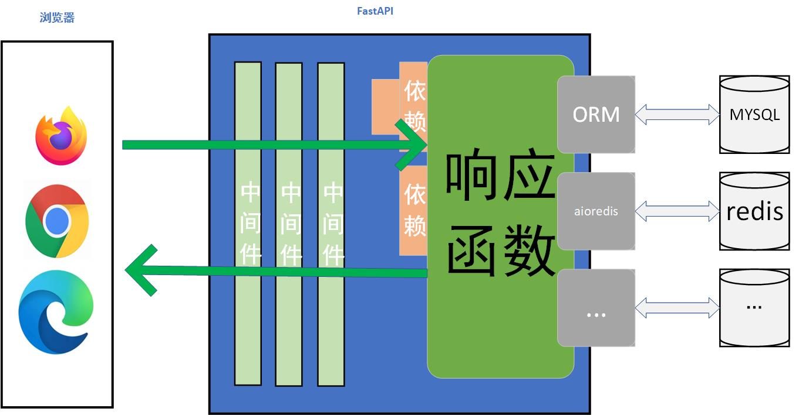

# 为什么要使用依赖？

- 共享业务逻辑（复用相同的代码逻辑）
- 共享数据库连接
- 实现安全、验证、角色权限
- 。。。

# 怎么使用依赖？

```python
def order_by_filed(order_by: List[str] = Query(..., description="按给定的字段排序，可以输入多个字段")):
    return {"order": order_by}

@app.get("/depends/order", summary="依赖的简单使用 - 排序")
def get_order(order: List[str] = Depends(order_by_filed)):
    return {"msg": order}
```

## 依赖嵌套

> A 接口需要排序，B 接口需要分页，C接口不仅排序还要分页，难道要写个依赖吗？

```python
def paginator(page: int = Query(1, gt=0, description="当前页码"),
              page_size: int = Query(10, gt=0, le=100, description="每页数量", alias="pageSize")) -> Dict[str, int]:
    return {"page": page, "page_size": page_size}


def order_by_filed(order_by: List[str] = Query(..., description="按给定的字段排序，可以输入多个字段")):
    return {"order": order_by}


def paginator_with_order(pg: Dict[str, int] = Depends(paginator), order: List[str] = Depends(order_by_filed)):
    return {"pg": pg, "order": order}


@app.get("/depends/page", summary="依赖的简单使用 - 分页")
def get_paginator(pg: Dict[str, int] = Depends(paginator)):
    return {"msg": pg}


@app.get("/depends/order", summary="依赖的简单使用 - 排序")
def get_order(order: List[str] = Depends(order_by_filed)):
    return {"msg": order}


@app.get("/depends/pg_plus", summary="依赖的嵌套使用 - 分页+排序")
def get_paginator_plus(pg_plus: dict = Depends(paginator_with_order)):
    return {"msg": pg_plus}
```
