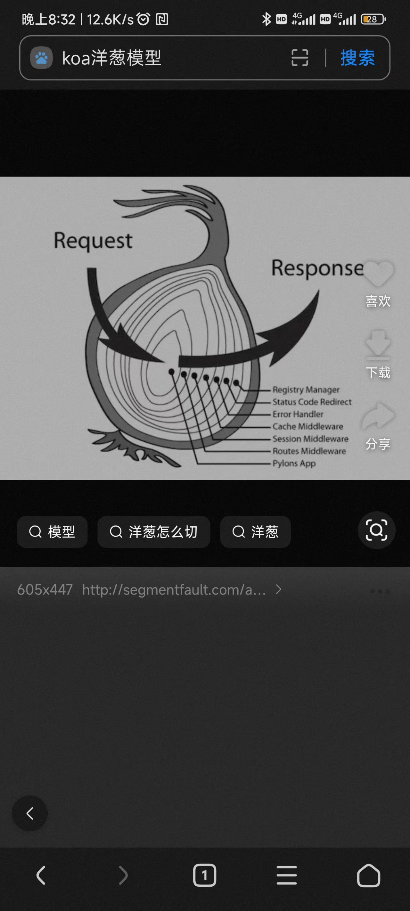
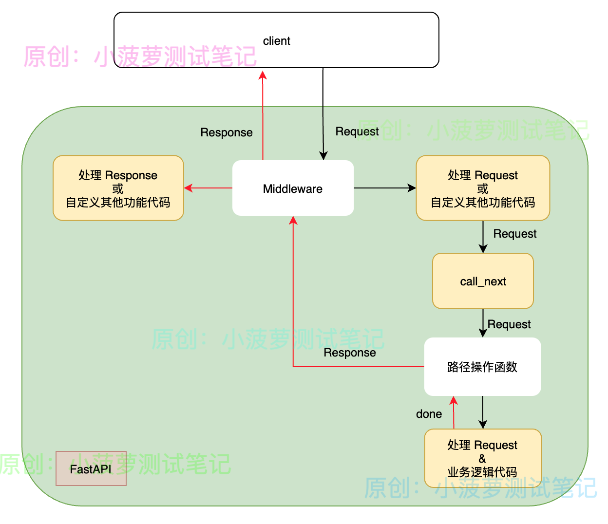

中间件会接收应用程序中的每个请求 Request
针对请求 Request 或其他功能，可以自定义代码块
再将请求 Request 传回路径操作函数，由应用程序的其余部分继续处理该请求
路径操作函数处理完后，中间件会获取到应用程序生成的响应 Response
中间件可以针对响应 Response 或其他功能，又可以自定义代码块
最后返回响应 Response 给客户端

中间件和包含 yield 的依赖项、Background task 的执行顺序
依赖项 yield 语句前的代码块
中间件
依赖项 yield 语句后的代码块
Background task
 

中间件函数接收两个参数
request：Request 请求，其实就是 starlette 库里面的 Request
call_next：是一个函数，将 request 作为参数

call_next
会将 request 传递给相应的路径操作函数
然后会返回路径操作函数产生的响应，赋值给 response
可以在中间件 return 前对 response 进行操作

重点
call_next 是一个函数，调用的就是请求路径对应的路径操作函数
返回值是一个 Response 类型的对象
.

当然，在请求进来的时候，是可以提前响应的，例如鉴权的中间件就可以在请求没权限的时候，直接返回，不用再走后面的流程了

